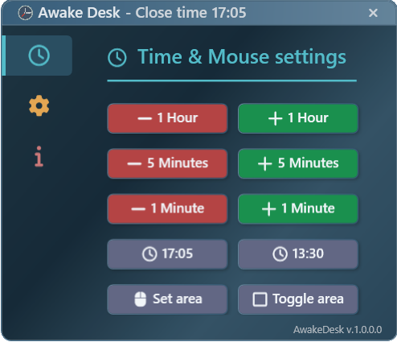
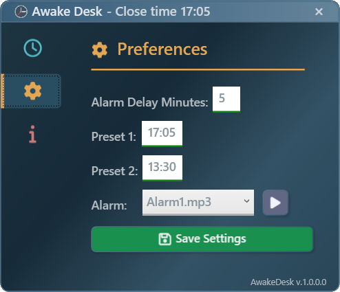

# AwakeDesk

AwakeDesk is a WPF-based software developed in C# to prevent the screen from locking and the PC from entering sleep mode. It achieves this by automatically moving the mouse cursor when the system is inactive. 

## Features

- **Automatic Mouse Movement**: Prevents screen lock and sleep mode by simulating mouse movement.
- **Auto-Deactivation Timer**: Set a specific time for the software to stop running automatically.
- **Targeted Mouse Movement**: Define a specific area where the cursor should move when the application is active.
- **Preset Timers**: Choose from predefined shutdown times for convenience.
- **Alarm Notification**: Receive an alarm notification *X* minutes before the software stops, where *X* is user-configurable (default = 5).
- **Settings Customization**: Modify and save your preferred configurations.

## Screenshots

### Time & Mouse Settings

This screen allows you to set the auto-deactivation time and define the target area for mouse movement.

### Preferences

This screen is used to configure and save application settings.

## Usage

- When the application starts, a small clock icon appears near the system clock on the primary monitor.
- Right-clicking the icon opens a context menu with the following options:
  - **Settings**: Opens the configuration windows shown in the screenshots.
  - **Quit**: Closes the application.

## Release Notes

To view all official releases, visit the [AwakeDesk releases page on GitHub](https://github.com/giague/AwakeDesk/releases).

### Version 1.1 (Latest Stable)
- **Automatic Updates**: Added a built-in update system for seamless version upgrades.  
- **Minor Fixes and Improvements**: Various bug fixes and performance enhancements.  

### Version 1.0  
- **Initial Release**: First stable version with core features, including automatic mouse movement and a deactivation timer.

## Contributing

Feel free to open issues or submit pull requests to improve the project.

## License

This project is licensed under the GNU General Public License v3.0. See the `LICENSE` file for details.

## Donate

